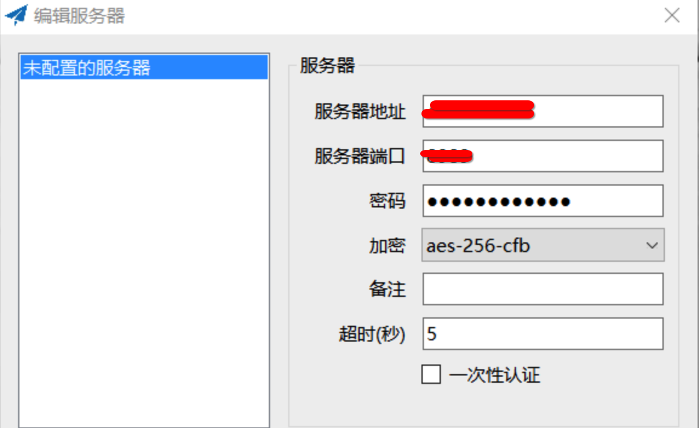
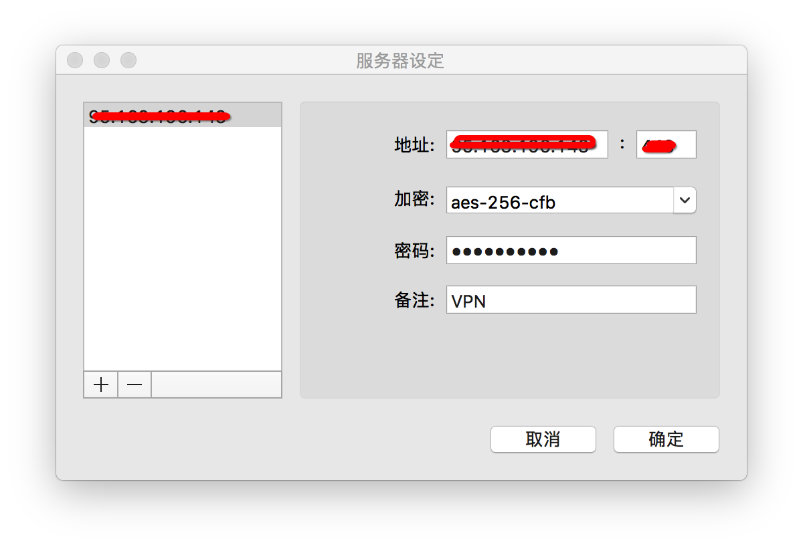
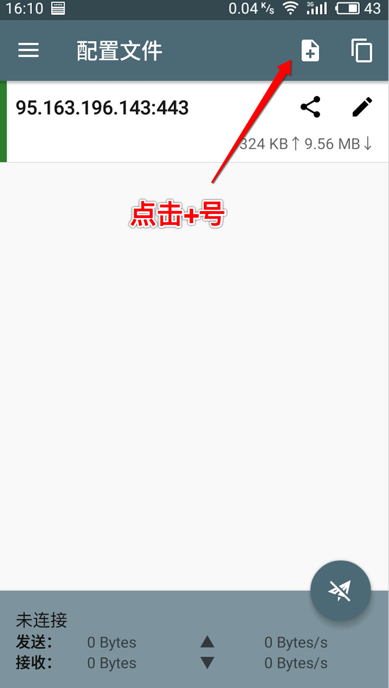
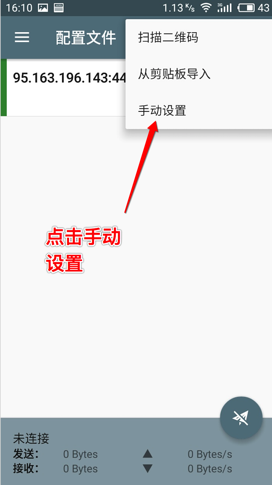
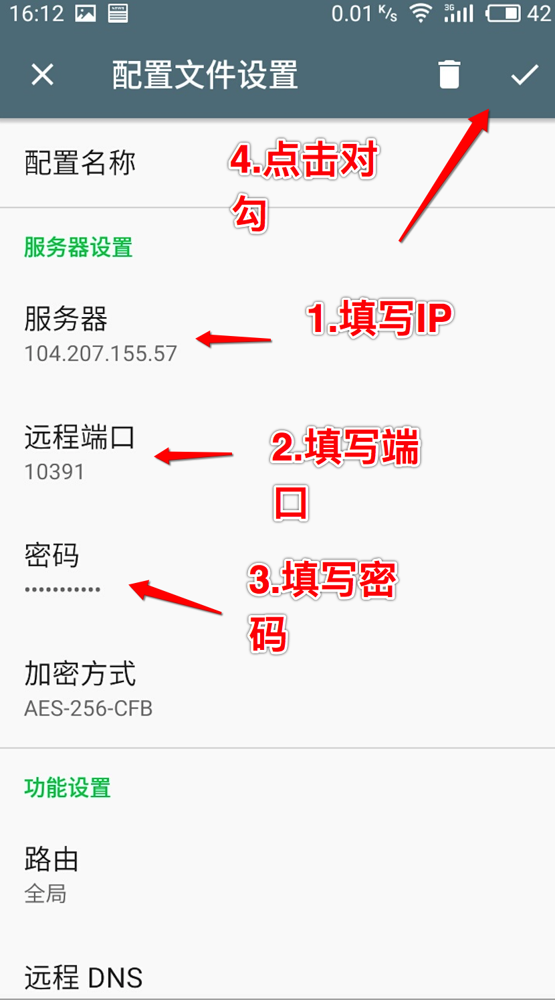
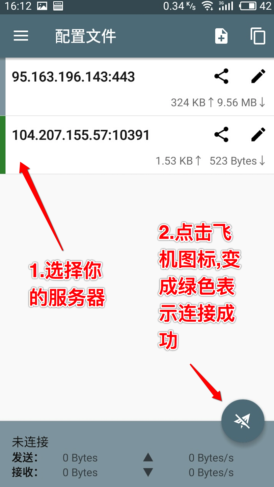

# shadowsocks
shadowsocks搭建方法

# 一.WIN平台

1.打开 https://github.com/shadowsocks/shadowsocks-windows/releases 下载Shadowsocks-4.0.8.zip

2.下载好Shadowsocks-4.0.8.zip，解压，里面只有一个Shadowsocks.exe。打开，输入服务器ip、端口、密码

3.如图所示

# 二.MAC平台
1.打开 https://github.com/shadowsocks/ShadowsocksX-NG/releases 下载ShadowsocksX-NG.1.7.1.zip

2.下载好ShadowsocksX-NG.1.7.1.zip，解压，里面只有一个ShadowsocksX-NG。拖入左边的应用程序，然后点击打开,输入服务器ip、端口、密码

3.如图所示

# 三.Android
1. 下载ShowdockSocks Android : https://github.com/shadowsocks/shadowsocks-android/releases

2. 点开APP

3. 看图依次操作

